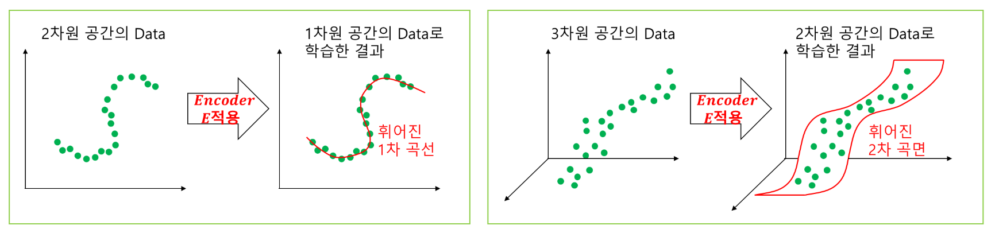
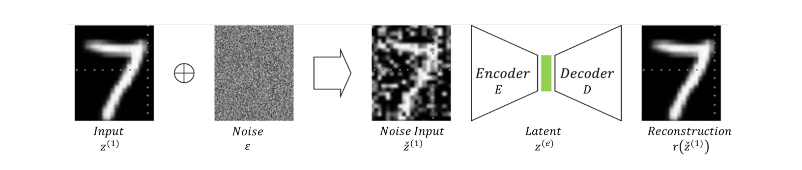

표현학습 representation learning
DNN의 은닉층을 거쳐가면서 vector들의 차원과 모습이 바뀌어가는 과정

다양체 학습 manifold learning
고차원에 존재하는 data는 해당 고차원 공간 내 저차원 공간의 data로 표현 가능하다는 manifold 가설에 기반한 학습방법
매니폴드 가설이 성립한다면, 고차원 data는 고차원 공간이 포함하는 저차우너 공간 위에 존재함.

AE에서 잠재공간(latent space)는 저차원 manifold임.

선형 회귀에서의 규제(regularization)
L1 Lasso 규제: $\sum_i |W_i| < \alpha$
	-> 회귀 계수가 0인 피처는 회귀 식에서 제외되면서 feature 선택의 효과를 얻을 수 있음.
L2 Ridge 규제: $\sum_i W_i^2 < \alpha$
	-> 회귀 계수의 크기를 감소시키지  0으로 만들지는 않음.

AE에서의 과적합 규제
i) AE의 train 재구성 오차(reconstruction error)가 $\epsilon$ 보다 작은 것들만 solution으로 채택
ii) val data에 대한 재구성 오차가 overfitting되기 직전 $W_E, W_D$를 찾음.
![[AE의 과적합 규제2.png]]

Denoise AE

$z^{(1)}$ : original input data
$\check z^{(1)}$ : original input data + noise
$r(\check z^{(1)}) = \hat z^{(1)}$ : ($z^{(1)}$, $\check z^{(1)}$) 쌍을 학습한 Decoder의 output
$minimize$  $Loss(W_E, W_D)$ = |$z^{(1)}$ - $r(\check z^{(1)})$|
DAE의 목적대로 재구성오차를 최소화한 DAE는 noise를 제거했다기 보단 원래 data를 찾아간 것.
	-> input data의 저차원 manifold 공간을 학습한 뒤 $\check z^{(1)}$를 $\hat z^{(1)}$로 **복원**
노이즈를 제거하는게 목적 X (targer이 노이즈가 되버림)
손상된 입력이 주어지면 모델이 학습한 원본 데이터의 특징을 바탕으로 가장 nice한 원본을 재구성해.
	-> 데이터의 본질적인 구조를 먼저 학습 후 $\check z^{(1)}$를 해당 공간(학습한 원본 데이터의 특징을 가진 저차원 $manifold$ 공간)에 복원 혹은 투영($projection$) = $\hat z^{(1)}$

DAE 학습의 수학적 의미
i) 데이터의 조건부 분포 학습
$p(z^{(1)}|\check z^{(1)})$, 즉 $\check z^{(1)}$가 주어졌을 때 $z^{(1)}$을 학습하려고 함.
ii) 데이터의 Manifold Learning
데이터 포인트들은 보통 공간 전체에 퍼져있는 것이 아니라, 더 낮은 차원의 매니폴드 상에 존재한다고 가정.
DAE는 $\check z^{(1)}$를 저차원에 가장 가까운 점 $z^{(1)}$로 되돌리기 위한 방법을 학습

AE -> '점으로 향하는 힘'
	- 데이터를 어떻게 복사할 지 생각 -> 데이터 분호의 특징을 놓칠 수 있음.
DAE -> '구조로 향하는 힘'
	- 원래 데이터의 저차원 매니폴드에서 벗어난 지점 $\check z^{(1)}$에서 다시 돌아오기 위한 복원력, 복원 벡터장을 학습

희소 오토인코더 Sparse AE
AE의 잠재공간 내 컴포넌트(node)를 일정 비율 $\alpha$만 활성화 하자.(like Lasso 규제)
이때 지정된 활성화비율 $\alpha$와 실제 잠재 공간에서 활성화되는 비율 $\beta$차이를 KLD로 측정.
SAE Loss = AE의 재구성오차(MSE) + $\alpha * D_{KL}(p||q)$
(이때 p는 임의로 지정한 $\alpha$의 비율만큼 활성화될 목표 확률, q는 실제로 활성화되는 확률)
위 목적함수에서의 $\alpha$는 $D_{KL}$가 제약조건에서 목적함수로 올라올 때 생긴 것.

특성 공간 feature space : 무엇을 측정했는가
data가 $n_0$개 특성을 가진다고 가정하면 해당 데이터들은 $R^{n_0}$차원(특성공간) 내 vector로 표현 가능함.

잠재 공간 latent space : 데이터의 본질적인 의미가 무엇인가가
잠재공간의 목표는 원본 data의 가장 중요한 정보와 패턴을 **보존**하면서 차원을 줄이는 것.
AE에서 잠재공간은 원본 고차원 공간의 부분공간이 아닌 비선형 변환을 통해 만들어진 새로운 공간.
만약 잠재공간이 입력 공간의 부분공간이라면 고차원의 특징중 몇개를 선택해 차원을 축소하는 의미없는 것과 같음.
- Latent Space의 주요 특징은 다음과 같음  
     **(i) 저차원** : Latent Space은 Feature Space보다 훨씬 낮은 차원()을 가짐  
     **(ii) 추상적 표현** : Latent Space의 각 차원은 고차원인 원본 Data의 직접적인 Feature가 아니라, Data의 의미  
     있는 변동을 설명하는 추상적인 "잠재 변수(Latent variables)"에 해당함  
      예를 들어, 얼굴 Image의 Latent Space에서는 특정 축이 "미소의 정도"나 "안경 유무"와 같은 의미를  
     가질 수 있음  
     **(iii) 정보 압축 및 Noise제거** : Latent Space은 원본 Data의 불필요한 Noise와 중복 정보를 제거하고, 핵심적인  
     정보만을 추출하여 효율적으로 표현함  
      이는 Model의 계산 효율성을 높이고, Data의 본질적인 구조를 파악하는 데 도움을 줌  
     **(iv) 생성 및 조작** : 생성형 Model(VAE, GAN)에서는 Latent Space의 점들을 보간하거나 Sampling하여 새로운  
     Data를 생성하거나, Latent vector를 조작하여 원본 Data의 특정 속성을 변화시키는 데 활용됨  
     **(v) 유사성** : Latent Space에서는 유사한 Data Point들이 서로 가깝게 위치하는 경향이 있음  
      이는 유클리드 거리 나 코사인 유사도와 같은 거리 측정으로 정량화될 수 있음

다양체 학습 Manifold Learning
다양체 가설 (Manifold Hypothesis):
고차원 데이터는 고차원 공간이 포함하는 저차원 공간 내 존재
-> 희소한 고차원 데이터를 저차원 공간에 표현(투영)할 수 있다는 의미

기계학습에서 다양체 가설
특성 공간에서 유용한 특징을 찾아 초점을 맞춰 학습하는 것만으로 충분하다
단순한 차원축소를 넘어서 저차원의 전체 공간을 학습

AE학습을 통해 얻은 잠재 공간은 Manifold를 학습한 결과물임.
이때 Manifold는 '원본 데이터의 실제 지형'라고 할 수 있고, 데이터가 생성되는 근본적이고 이상적인 '연속적인' 구조임. 데이터가 sampling된 모집단의 본질 그 자체.
잠재 공간 Latent space는 이 '실제 지형(manifold)을 압축한 지도'임

---

**매니폴드(Manifold)와 Autoencoder로 학습한 저차원 Latent Space의 관계**  

- 두 용어는 매우 밀접하게 관련되어 있지만, 개념적으로는 명확히 구분됨  
    
- 간단히 말해, Autoencoder 학습을 통해 얻은 **잠재 공간(Latent Space)은 Manifold를 학습한  
    결과물** 임  
     **(i) Manifold: Data의 '원본 설계도'**  
     **(a) 정의**  
      Data가 생성되는 근본적이고 이상적인 **연속적인 구조** 를 의미함  
      즉 Manifold는즉, Sample이 추출된 **Population의 내재적 구조** 임  
      이는 고차원 공간 안에 내재된, 보이지 않는 저차원의 기하학적 형태임  
      **연속적인 구조** 라고 하는 이유는 Data Point 하나하나는 그 변화 과정의 '스냅샷'에 불과하며, Manifold는 이 스냅샷들 사이를 잇는 부드러운 경로 전체를 의미함  
     **Sample Data** : 우리가 가진 개별 사진들은 이 경로 위에 찍힌 '점'과 같음  
     **Manifold** : 이 점들을 모두 포함하며 그 사이사이를 빈틈없이 채우는 '선' 또는 '면' 전체를 의미함  
     **(b) 역할**  
      Autoencoder Model이 **학습해야 할 대상(Target)** 이자, Data가 추출된 Population 본질 그 자체임  
     **(b) 예**  
      현실 세계의 모든 얼굴이 따르는 완벽하고 **연속적인 구조**  
     **(ii) 잠재 공간 (Latent Space): 학습된 '압축 지도'**  
     **(a) 정의**  
      Autoencoder의 Encoder가 만들어낸 구체적인 결과물인 저차원 vector 또는 공간  
      원본 Data를 압축하여 표현하는 새로운 저차원 vector 공간임  
     **(b) 역할**  
      Manifold를 학습하고 표현(Representation)하는 Autoencoder Model의 결과물임  
     **(b) 예**  
      Autoencoder가 학습한 후, 특정 축이 '미소'를 담당하고 다른 축이 '나이'를 담당하게 된 32차원의 vector 공간

AE를 이용한 Manifold 학습의 시각화
저차원으로 투영한 데이터의 시각화는 원본 데이터의 왜곡된 모습을 보는 것

결국 목적은 데이터를 샘플링한 모집단을 추정(학습)하는 것

Q1. AE로 찾은 잠재 공간과 다양체 가설에서 말하는 고차원 데이터가 속하는 저차원 매니폴드는 같은 공간인가 다른 공간인가?
다양체 가설에서 말하는 저차원 매니폴드는 데이터가 생성되는 근본적인 공간
AE로 찾은 잠재 공간은 다양체 가설에서 말하는 가정된 저차원 매니폴드를 학습한 저차원 공간

AE는 재구성만 잘 되면 되기 때문에 거리나 연결성 같은 위상적 구조를 명시적으로 보존하도록 설계하지 않은.
반면, isomap이나 LLE같은 전통적인 다양체 학습 알고리즘은 위상적 구조(ex. 측지선 거리)를 보존하는 것을 직접적인 목표로 삼음.
때문에 AE가 찾은 공간은 True Manifold와는 다른 기하학적 형태를 가질 수 있음.

